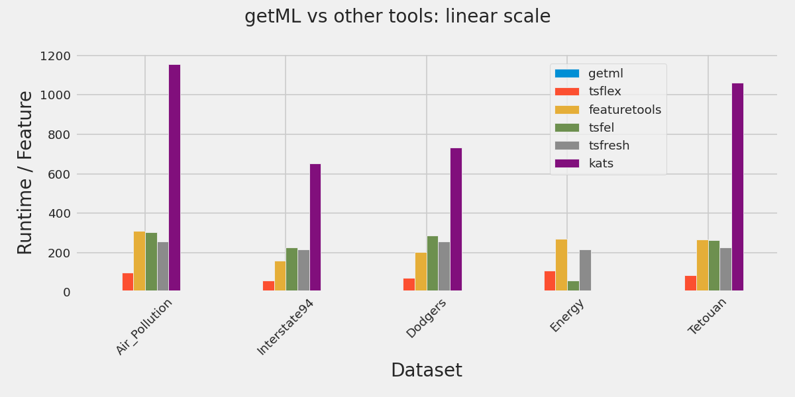
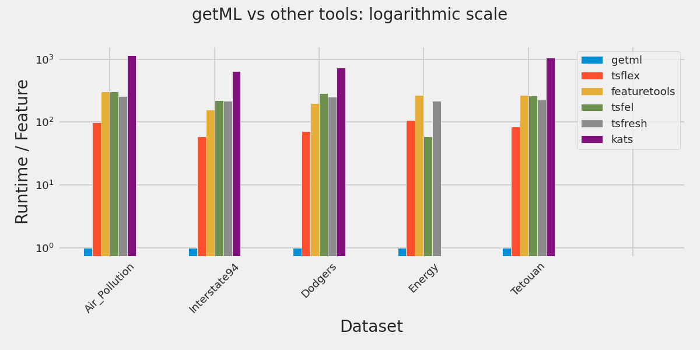

<p align="center" style="text-align: center;">
    
    
</p>

<p align="center" style="text-align: center;">
        <a href="https://getml.com/contact/lets-talk/" target="_blank">
        </a>
        <a href="mailto:contact@getml.com" target="_blank">
        </a>
        <a href="LICENSE.txt" target="_blank">
        </a>
</p>


# getML - Automated Feature Engineering for Relational Data and Time Series

getML is a tool for automating feature engineering on relational data
and time series. Unlike similar tools, it includes a database engine 
that has been customized for this very purpose.

Because of this customized database engine, it is very fast. In fact, it is
between 60x to 1000x faster than other open-source tools for automated
feature engineering.

## What kind of features does getML generate?

getML generates features for relational data and time series. These include, but are not limited to:

- **Various aggregations**, i.e. average, sum, minimum, maximum, quantiles, exponentially weighted moving average, trend, exponentially weighted trends, ...
- **Aggregations within a certain time frame**, i.e. maximum in the last 30 days, minimum in the last 7 days
- **Seasonal factors from time stamps**, such as month, day of the week, hour, ...
- **Seasonal aggregations**, i.e. maximum for the same weekday as the prediction point, minimum for the same hour as the prediction point, ...

In other words, it generates the kind of features you would normally build manually. But it automatically generates thousands of features and then automatically picks the best, saving you a lot of manual work.

More importantly, it can do so considerably faster than any other open-source framework for these purposes. As far as we know, it is the fastest open-source tool for feature engineering in the world!

## Benchmarks

We evaluated the performance of getML's FastProp algorithm against five other open-source tools for automated feature engineering on relational data and time series: _tsflex_, _featuretools_, _tsfel_, _tsfresh_ and _kats_. The datasets used include:

1. Air Pollution | Hourly data on air pollution and weather in Beijing, China.
2. Interstate94 | Hourly data on traffic volume on the Interstate 94 from Minneapolis to St. Paul.
3. Dodgers | Five-minute measurements of traffic near Los Angeles, affected by games hosted by the LA Dodgers (an American baseball team).
4. Energy | Ten-minute measurements of the electricity consumption of a single household.
5. Tetouan | Ten-minute electricity consumption of three different zones in Tetouan City, Mexico

The plots shown below contain the *runtime per feature* calculated relative to the runtime per feature of the fastest approach. The fastest approach turns out to be the getML's FastProp, so it gets a value 1.

We observe that for all datasets, the features produced by the different tools are quite similar, but __getML is 60-1000 times faster than other open-source tools__. 

<p align="center">
    
</p>

In fact, the speed-up is so big that we need a logarithmic scale to even see the bar for getML.

<p align="center">
    
</p>

Please refer to the benchmark folder in this repository, if you want to reproduce the results.

## Example 

Here is how you can build a complete Data Science pipeline for a time series problem with seasonalities with just a few lines of code:

```python
import getml

getml.engine.launch()
getml.set_project("interstate94")

# Load the data.
traffic = getml.datasets.load_interstate94(roles=False, units=False)

# Set the roles, so getML knows what you want to predict
# and which columns you want to use.
traffic.set_role("ds", getml.data.roles.time_stamp)
traffic.set_role("holiday", getml.data.roles.categorical)
traffic.set_role("traffic_volume", getml.data.roles.target)

# Generate a train/test split using 2018/03/15 as the cutoff date.
split = getml.data.split.time(traffic, "ds", test=getml.data.time.datetime(2018, 3, 15))

# Set up the data:
# - We want to predict the traffic volume for the next hour.
# - We want to use data from the seven days before the reference date.
# - We want to use lagged targets (autocorrelated features are allowed).
time_series = getml.data.TimeSeries(
    population=traffic,
    split=split,
    time_stamps="ds",
    horizon=getml.data.time.hours(1),
    memory=getml.data.time.days(7),
    lagged_targets=True,
)

# The Seasonal preprocessor extracts seasonal
# components from the time stamps.
seasonal = getml.preprocessors.Seasonal()

# FastProp extracts features from the time series.
fast_prop = getml.feature_learning.FastProp(
    loss_function=getml.feature_learning.loss_functions.SquareLoss,
    num_threads=1,    
    num_features=20,
)

# Use XGBoost for the predictions (it comes out-of-the-box).
predictor = getml.predictors.XGBoostRegressor()

# Combine them all in a pipeline.
pipe = getml.pipeline.Pipeline(
    tags=["memory: 7d", "horizon: 1h", "fast_prop"],
    data_model=time_series.data_model,
    preprocessors=[seasonal],
    feature_learners=[fast_prop],
    predictors=[predictor],
)

# Fit on the train set and evaluate on the testing set.
pipe.fit(time_series.train)
pipe.score(time_series.test)
predictions = pipe.predict(time_series.test)
```

To see the full example, check out the Interstate94 notebook ([interstate94.ipynb](demo-notebooks/interstate94.ipynb)).

## Documentation

Check out the full documentation on https://docs.getml.com/latest/.

## Demo notebooks

To experience getML in action, the following example notebooks are provided in the [demo-notebooks](demo-notebooks) directory:

| Notebook                                                      | Prediction Type  | Population Size | Data Type   | Target  | Domain           | Difficulty | Comments                                        |
| ------------------------------------------------------------- | ---------------- | --------------- | ----------- |-------- | ---------------- | ---------- | --------------------------- |
| [adventure_works.ipynb](demo-notebooks/adventure_works.ipynb) | Classification   | 19,704          | Relational  | Churn   | Customer loyalty | Hard       | Good reference for a complex data model         |
| [formula1.ipynb](demo-notebooks/formula1.ipynb)               | Classification   | 31,578          | Relational  | Win     | Sports           | Medium     |                                                 |
| [loans.ipynb](demo-notebooks/loans.ipynb)                     | Classification   | 682             | Relational  | Default | Finance          | Easy       | Good notebook to get started on relational data |
| [interstate94.ipynb](demo-notebooks/interstate94.ipynb)       | Regression       | 24,096          | Time Series | Traffic | Transportation   | Easy       | Good notebook to get started on time series     |
| [robot.ipynb](demo-notebooks/robot.ipynb)                     | Regression       | 15,001          | Time Series | Force   | Robotics         | Medium     |                                                 |
| [seznam.ipynb](demo-notebooks/seznam.ipynb)                   | Regression       | 1,462,078       | Relational  | Volume  | E-commerce       | Medium     |                                                 |


## Installation

### Linux

Before the installation, make sure your Linux meets the following requirements:
- GLIBC 2.17 or above (check by using `ldd --version`)
- On Fedora 30, you need _libxcrypt-compat_. Install using: `yum install libxcrypt-compat`.
- Python 3.8 or above, _numpy_ and _pandas_ (for the Python API).


There are two components of the getML community edition: 
1. The Python API | Helps you interact with the getML engine
2. The getML engine | The C++ backend of getML

The Python API can be installed from the Python Package Index by executing the following command in a terminal:

```bash
pip install getml
```

The getML engine comes with the Python API and is installed automatically. However, if you want to install it separately, please execute the following commands,
replacing `ARCH` with either `x64` or `arm64`, depending on your architecture. If you are unsure, `x64` is probably the right choice. You can also use
`uname -m` to figure out the architecture. If it says something like `aarch64` or `arm64`, you need to use `arm64`, otherwise go with `x64`.

```bash
# Downloads the tar file of the engine
wget https://static.getml.com/download/1.4.0/getml-1.4.0-ARCH-community-edition-linux.tar.gz

# Extracts the tar file
tar -xf getml-1.4.0-ARCH-community-edition-linux.tar.gz

# Changes directory 
cd getml-1.4.0-ARCH-community-edition-linux

# Installs the engine
./getML install
```

Alternatively, you install the API from this repository. If you do this, you also have to install the engine as indicated above:

```bash
# Changes directory 
cd src/python-api

# Installs the python API
pip3 install .
```

### Docker (for macOS, Windows or Linux)

Before the installation, make sure your system meets the following requirements:

- [Docker](https://www.docker.com/) | On Linux, make sure that you follow these post-installation steps to run docker without root rights/sudo: https://docs.docker.com/engine/install/linux-postinstall/

- Bash | Pre-installed on Linux and macOS. For Windows, we recommend [Git Bash](https://gitforwindows.org/).

- [OpenSSL](https://www.openssl.org/) | Pre-installed on most systems.

Once the requirements are met, the following steps should be followed:

1. Download the getml community edition for Docker from the following URL: https://static.getml.com/download/1.4.0/getml-1.4.0-community-edition-docker.zip

2. Extract `getml-1.4.0-community-edition-docker.zip` in a folder.

3. Make sure that Docker (the Docker daemon) is running.

4. Execute `setup.sh`. On Windows, open the folder in which the zip file was extracted and just click on `setup.sh`. On macOS and Linux, do the following:

    ``` bash
    cd getml-1.4.0-community-edition-docker
    bash setup.sh # or ./setup.sh
    ```

    This will run the Dockerfile and setup your Docker image. It will also create a Docker volume called 'getml'.

5. Execute `run.sh`. On Windows, you can just click on `run.sh`. On macOS and Linux, do the following:

    ```bash
    bash run.sh # or ./run.sh
    ```

    This will run the Docker image. 

## Deinstallation

### Linux

You will have to remove the folder `.getML` from your home directory. In a terminal, execute: 
```
rm -r $HOME/.getML
```

### Docker

On Windows, you can just click on uninstall.sh.

On macOS and Linux, execute the following in a terminal:

```
bash uninstall.sh # or ./uninstall.sh
```


## Compiling from source

Because getML is a complicated software, we use Docker
for our build environment. If you want to compile it from source,
here is what you have to do:

On a Linux machine, install Docker (if you don't have a Linux
machine, we recommend https://multipass.run):

https://docs.docker.com/engine/install/ubuntu/

Also make sure that you follow the post-installation steps for Linux, so
can launch Docker without root rights:

https://docs.docker.com/engine/install/linux-postinstall/

Then, do the following, again replacing `ARCH` with either `x64` or `arm64`:

```bash
# Go to the linux folder inside the repository
cd linux-ARCH

# Set up the Docker container (you only have to do this once)
./build.sh init_docker

# Download and compile the dependencies - this will
# take a while (you only have to do this once)
./build.sh init

# Builds the package
./build.sh p

# Runs the newly built engine
./build.sh x
```

From now on, whenever you want to build a new
package, you can do that with one simple command:

```bash
./build.sh p
```

If you want to change the C++ code and then compile only the engine,
you can do the following:

```bash
./build.sh c
```

Likewise, if you want to change the Go code and then compile only the entrypoint,
you can do the following:

```bash
./build.sh app
```
