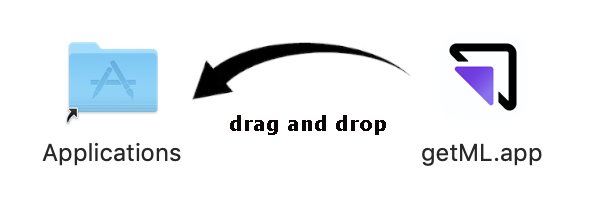

Install getML on macOS
======================

This installation guide explains all necessary steps to install getML on macOS.
To download the getML suite, go to 

https://getml.com/product/

and click the download button. This will download a disk image containing
everything you need to use getML: The :ref:`getML engine<the_getml_engine>`,
the :ref:`getML monitor<the_getml_monitor>`, and the :ref:`Python API
<the_getml_python_api>`.

System requirements
^^^^^^^^^^^^^^^^^^^

Your Mac should meet at least the following requirements to
successfully install getML

* macOS must be version 10.14 or newer. You can check your macOS version by
  running the following command in a terminal: :code:`sw_vers`

* Python 3.7 or above must be installed on your machine. Furthermore, `numpy`
  and `pandas` are required dependencies for the getML Python API.

_____

Install and run the getML engine and monitor
^^^^^^^^^^^^^^^^^^^^^^^^^^^^^^^^^^^^^^^^^^^^

The getML engine is the C++ backend of getML. It comes with a graphical
user interface - the getML monitor - that runs in your browser. To install these
components

1. Double-click the :code:`dmg`-file to open the installer, then drag the getML
   Icon into the Applications folder.

2. Double-click **getML.app** in the Applications folder to start
   getML. A security feature in macOS will ask you to confirm that you
   want to open getML when launching it for the first time. After
   confirmation the getML icon in your status bar indicates that the
   getML engine is running.

.. image:: install_mac2.png

3. Open a browser and visit http://localhost:1709/ (if opening the
   getML.app did not point you there automatically). 

Install the getML Python API
^^^^^^^^^^^^^^^^^^^^^^^^^^^^

The Python API is a convenient way to interact with and to control the
getML engine. There are two options to install the getML Python API

From PyPI
-----------

In a terminal execute the following command to install the remote
version from the Python Package Index

.. code-block:: bash

    pip install getml
    
To make sure that the Python API was installed properly, you can use

.. code-block:: bash

    python -c 'import getml'

_____

Install the getML-CLI
^^^^^^^^^^^^^^^^^^^^^

getML comes with a :ref:`command-line interface<api_documentation_cli>` (CLI) that lets you configure the most
important parameters on startup. The CLI is a standalone Go-binary. 
The CLI is optional. If you are fine with launching
getML from your Launchpad, you can stop reading.

Before you can use the CLI, you have to have launched getML from your Launchpad
at least once. This is because  when you launch getML for the first time, 
it creates a hidden folder in your home directory (called :code:`.getML`) into
which it copies the binaries and all necessary resources. 
Said hidden folder is then accessed by the CLI. 

After launching getML for the first
time, you can find the CLI in :code:`$HOME/.getML/getml-VERSION`.

.. code-block:: bash

    ./getml-cli

You can move :code:`getml-cli` anywhere you want. We recommend moving the :code:`getml-cli`
to a location included in the :envvar:`PATH` environment variable,
such as :code:`/usr/local/bin`. You can inspect the content of the
aforementioned variable in a shell using

.. code-block:: bash
				
   echo $PATH

and check if it can be properly found by executing

.. code-block:: bash
				
	which getml-cli
	
If you see the location you moved the binary to as output, you are
ready to go.

For further help on how to use the CLI, just use :code:`getml-cli -h` or :code:`getml-cli -help`: 

Uninstall getML
^^^^^^^^^^^^^^^

To uninstall getML from your Mac

1. Drag :code:`getml.app` from your applications folder into the trash.
2. Remove the folder :code:`.getML` from your home directory. To do
   so, open your Finder and go to your home directory (:kbd:`Cmd +
   Shift + H`). Hit :kbd:`Cmd + Shift + .` to show the hidden
   files. Identify :code:`.getML` and move it to the trash.
3. Delete :code:`getml-cli` from wherever you have put it (if you have decided to 
   install :code:`getml-cli`).

Where to go next
^^^^^^^^^^^^^^^^

The :ref:`Getting started guide <getting_started>` provides an
overview of the functionality of getML and a basic
example of how to use the Python API. In order to get help or provide feedback,
please contact our :ref:`support <support>`.
